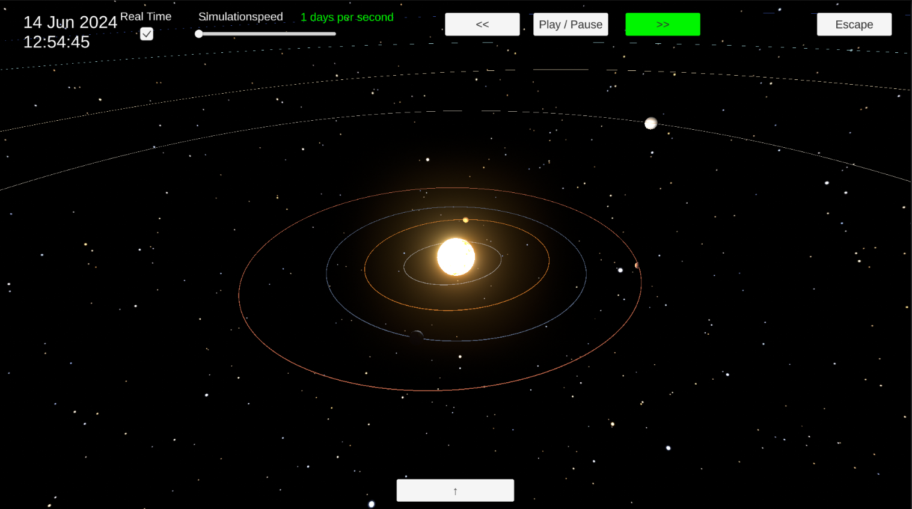

# Solar System Simulator
The **Solar System Simulator** is an interactive simulation of our solar system. Using mathematical calculations, the gravitational influences of celestial bodies are visually represented and users have the opportunity to individually modify the solar system. For example, they can add new planets to simulate the effects on our solar system or display the constellation of planets over time. 

## Project Technology
The **Solar System Simulator Project** is built with **Unity**. Unity is a game engine that runs on **C#** and is therefore a good choice for building 3D interactive simulations. This project is running on **Unity Editor Version 2022.3.18f**. This choice was made because, during the development of this project, the team also had another subject where Unity with this version was being used.

## Project Setup
If you want to run the project on your own local machine, you can follow these steps:
1. Download **Unity Hub** from the Unity homepage: [https://unity.com](https://unity.com)
2. After the installation of Unity Hub, clone this repository on your machine.
3. Click **Projects > Add** and choose the root folder of the cloned project.
4. If the needed editor version for this project is not already installed on your machine, you will get a prompt to install the specific version. Click on **Install Version**.
5. After the project is added to Unity Hub, it opens automatically in a new Unity Editor window.
6. To run the application in Unity Editor, go to **Assets > Scenes** in the Project Folder and double-click on the **MainMenuScene**.
7. Click the **Play** button to start the application.

## Application Tutorial
To learn more about how the application works, visit the dedicated website of the **Solar System Simulator Project**: [Link to Tutorial](http://160.85.252.39:8080/tutorial)

## Continuous Integration
This project is linked to an **Appveyor Project**, which creates the **SonarQube analysis** and deploys it on the **SonarQube Server**. The specified file yaml file for the Appveyor Project can be found here: [appveyor.yml](appveyor.yml)
To run the Appveyor build successfully, these points need to be fulfilled:
- The code needs to be pushed either to the **main** or **dev** branch
- The project must be **buildable**
- All tests must **pass**
- The **SonarQube server** must be reachable
Only then is the SonarQube analysis successful and deployed to the SonarQube server: [Link to SonarQube server](http://160.85.252.39:9000)

## Links

- [Project Repo](https://github.zhaw.ch/Team-42/Solar-System-Simulator)
- [Website Repo](https://github.zhaw.ch/Team-42/solar-system-simulator-webpage)
- [Solar System Simulator Website](http://160.85.252.39:8080)
- [SonarQube Server](http://160.85.252.39:9000)

## Team Members

| Name | Acronym  | E-Mail | IP |
| - |----------| - | - |
| Ivan Starcevic | starciva | starciva@students.zhaw.ch | - |
| Fabian Walter | waltefab | waltefab@students.zhaw.ch | - |
| Alexis Tziantopoulos | tzianale | tzianale@students.zhaw.ch | - |
| Aleksandar Stojilkovic | stojial  | stojial1@students.zhaw.ch | - |
| Riccardo Maffei | mafferic | mafferic@students.zhaw.ch | - |
| Juvan Thavalingam | thavajuv | thavajuv@students.zhaw.ch | - |
